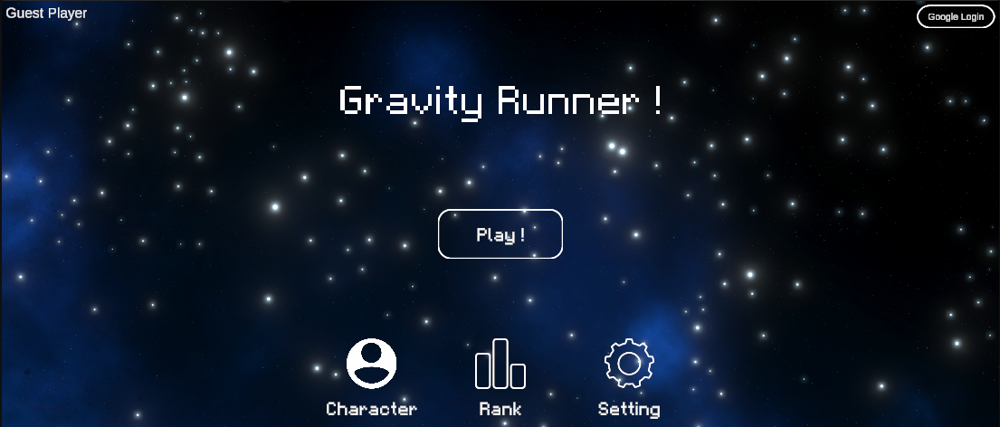
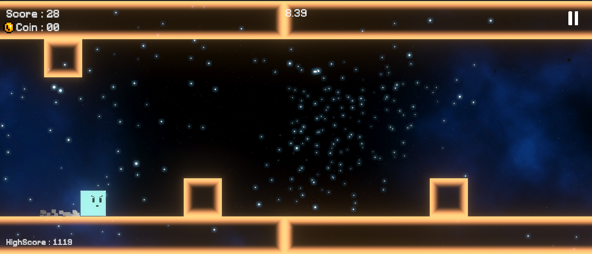
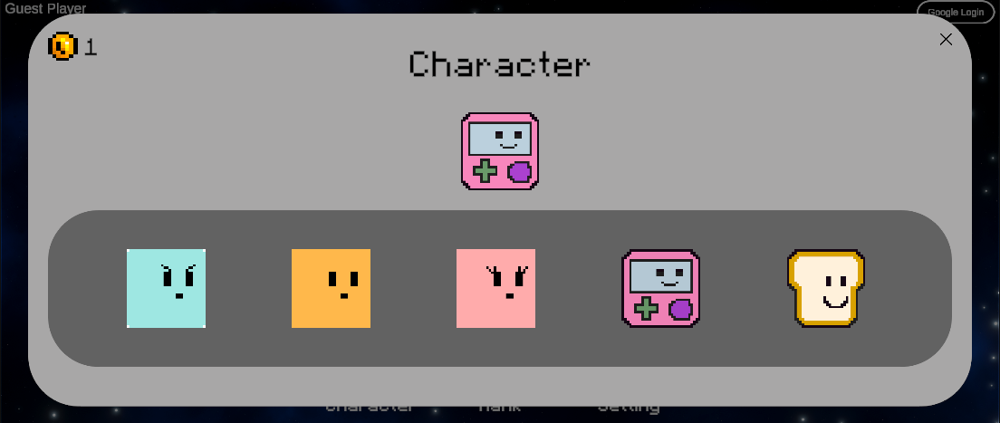

# Gravity Runner

Unity/C#으로 개발한 모바일 원터치 중력 반전 러너 게임입니다.

개인 프로젝트로 개발하여 Google Play 출시까지 완료했으며,  
개발 및 기능 확장 과정에서 캐릭터 시스템, 계정 데이터, 랭킹, 광고 제어 등의 기능을 구현했습니다.

## Screenshots

### Lobby


### Gameplay


### Character Select


> 본 저장소는 취업 포트폴리오를 위한 코드 공개 저장소입니다.  
> 외부 에셋과 서비스 설정 파일은 제외하고 직접 작성한 주요 C# 코드를 정리했습니다.

## Project Overview

- Engine: Unity
- Language: C#
- Platform: Android
- Development: Personal Project
- Release: Google Play
- Genre: One-Touch Gravity Runner

화면을 터치하여 중력 방향을 반전시키고 장애물을 피하며 점수를 획득하는 러너 게임입니다.

초기에는 실제 출시까지 완료하는 것을 목표로 비교적 단순한 구조에서 개발을 시작했습니다.  
이후 캐릭터 구매 및 선택, 캐릭터별 능력, 계정 저장, 랭킹 등의 기능을 추가하면서 기존 구조를 확장했습니다.

## Key Features

- 중력 반전을 이용한 원터치 플레이
- 무한 스크롤 플랫폼 및 장애물 생성
- 플레이 시간에 따른 난이도 증가
- 캐릭터 구매 및 선택
- 캐릭터별 고유 능력
- Google Play Games 로그인 및 랭킹
- 로컬 / 클라우드 계정 데이터 관리
- 보상형 광고
- Firebase Remote Config를 이용한 광고 활성화 제어

## Tech Stack

- Unity
- C#
- UniTask
- Addressables
- Google Play Games Services
- Google Mobile Ads
- Firebase Remote Config

## Highlighted Implementation

### 1. Character System

초기에는 하나의 고정 캐릭터만 사용하는 구조였습니다.

캐릭터 구매 및 선택과 캐릭터별 능력이 추가되면서  
캐릭터 데이터, UI, 계정 저장 데이터, 실제 플레이 캐릭터 생성 과정까지 함께 확장해야 했습니다.

캐릭터별 능력을 `Player` 내부에서 직접 분기하지 않고  
`IAbility` 인터페이스를 통해 능력 구현을 분리했습니다.

게임 시작 시 저장된 캐릭터 ID를 기준으로 Addressables에서 캐릭터 프리팹을 불러오고,  
해당 캐릭터에 맞는 `IAbility` 구현을 생성하여 `Player`에 주입하도록 구성했습니다.

이를 통해 플레이어의 기본 동작과 캐릭터별 능력을 분리하여 관리했습니다.

**관련 코드**

- [`IAbility.cs`](Script/Player/IAbility.cs)
- [`Player.cs`](Script/Player/Player.cs)
- [`GameManager.cs`](Script/Main/Manager/GameManager.cs)
- [`CharacterModel.cs`](Script/Lobby/Character/CharacterModel.cs)
- [`CharacterPresenter.cs`](Script/Lobby/Character/CharacterPresenter.cs)

### 2. Account & Google Play Games

로그인 상태에 따라 로컬 데이터 또는 Google Play Games Saved Game 데이터를 사용하며,  
최고 점수, 코인, 선택 캐릭터, 해금 캐릭터 정보를 저장하도록 구성했습니다.

**관련 코드**

- [`AccountData.cs`](Script/AccountData.cs)
- [`AccountManager.cs`](Script/AccountManager.cs)
- [`GPGSManager.cs`](Script/GPGSManager.cs)

### 3. Game Systems

플랫폼과 장애물처럼 반복적으로 생성되는 오브젝트는 오브젝트 풀을 사용해 관리했습니다.

게임 내 시스템 간 이벤트 전달에는 EventBus를 사용했으며,  
리소스의 비동기 로드에는 UniTask와 Addressables를 활용했습니다.

**관련 코드**

- [`PoolManager.cs`](Script/Main/Manager/PoolManager.cs)
- [`ObjectPool.cs`](Script/Utillity/ObjectPool.cs)
- [`EventBus.cs`](Script/Utillity/EventBus.cs)
- [`AddressableLoader.cs`](Script/Utillity/AddressableLoader.cs)

## Repository Structure

```text
Script/
├─ Lobby/          # 로비, 캐릭터 선택, 랭킹
├─ Main/           # 게임 진행, 스폰, UI, 장애물
├─ Player/         # 플레이어 및 캐릭터 능력
├─ SO/             # ScriptableObject 데이터 정의
├─ Utillity/       # EventBus, ObjectPool, Addressables 등
├─ AccountManager.cs
└─ GPGSManager.cs
```

외부 에셋, 빌드 파일, 광고 및 서비스 설정 파일은 포함하지 않았습니다.
